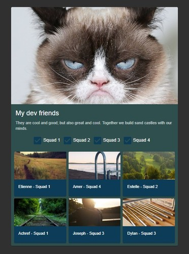
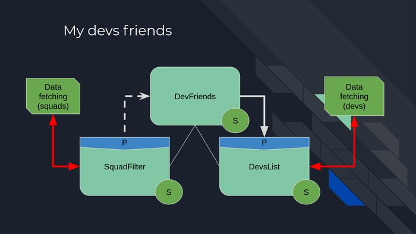

# React ES6 classes vs React functional components & hooks workshop

Here is a little workshop to help my team move to react FCs and hooks.

## I'm twelve and what is this

The repo contains a pretty basic CRA displaying a squad filter and a list of developpers.

## Components

This app is made of three components. Here is a schema of how they interact with one another:

Each component has been written both with ES6 classes and with FCs and hooks.

- **SquadFilter** : displays controls to filter devs by squad. Maintains its own state for these controls, and notifies its parent (**DevFriends**) of changes made to the selected squads. The squads themselves are asynchronous data (that may be provided by an API, for example).
- **DevFriends** : working as a container, that component is composed by the filters and the list. It passes down to **DevsList** the selected squads.
- **DevsList** : displays developpers. These users are asynchronous data.
